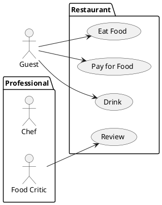
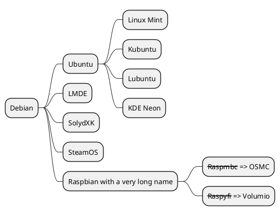

# plantuml网页配置
* 安装PlantUML

```bash
sudo apt update
sudo apt install -y plantuml
```
* 编辑 Gemfile 文件，添加 jekyll-plantuml 插件

```
source "https://rubygems.org"

gem "jekyll"
gem "kramdown-plantuml"

group :jekyll_plugins do
  gem "jekyll-feed"
  gem "jekyll-seo-tag"
end
```

* 编辑 _config.yml 文件，添加 jekyll-plantuml 插件

```
collections:
  authors:
    output: true

defaults:
  - scope:
      path: ""
      type: "authors"
    values:
      layout: "author"
  - scope:
      path: ""
      type: "posts"
    values:
      layout: "post"
  - scope:
      path: ""
    values:
      layout: "default"

plugins:
  - "kramdown-plantuml"
```

* 使用PlantUML


# plantuml教程网站

```
https://plantuml.com/
```

# 实现
```plantuml
Cat -> Dog : hello
Dog -> Cat : hi
```



